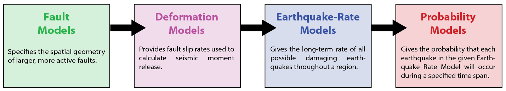

An Earthquake Rupture Forecast (ERF) gives the probability of all possible, damaging (e.g., M≥5) earthquakes over a specified time span. Our goal is to construct a Uniform California ERF (or UCERF) where "Uniform" emphasizes the desire have consistent methodologies applied across the state (to the extent justified given data heterogeneities).  We are building a variety of UCERFs to represent both the progression of our scientific understanding and the range of opinions on how to construct such a model at any given time.

To this end, we have adopted a modular design (via object-oriented programming; [OpenSHA](https://opensha.org/)) which allows alternative components to be "plugged in". This facilitates both establishing multiple branches of a logic tree, and the replacement of simpler initial components with more sophisticated components when they become available. Such an adaptive framework allows us to provide useful UCERFs now while simultaneously "thinking big" with respect to potential alternatives later. This "living model" will also enable relatively rapid forecast modifications following any large events.

Each UCERF is composed of four main model components applied in succession:

There will generally be alternative versions of each component, which could represent improvements made over time (e.g., versions 1.0, 2.0, 3.0, ...), or viable alternatives within any version (e.g., 2.0, 2.1, 2.2, ...).

Some of the above model components might be composed of sub-model components (e.g., representing alternative ways of computing time-dependent probabilities).

Please see the documentation for specific UCERF models for further details.
