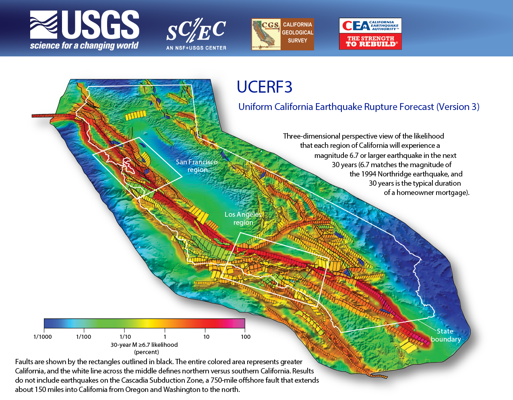

## The Third California Earthquake Rupture Forecast (UCERF3)

[A Synoptic Overview (SRL Publication)](http://srl.geoscienceworld.org/content/early/2017/07/07/0220170045)

## Long-Term Models

### Quick Information

* [Fact Sheet](https://pubs.usgs.gov/fs/2015/3009/) (a non-technical summary)
* [Press Release](https://www.usgs.gov/news/new-long-term-earthquake-forecast-california)
* [Video](https://www.youtube.com/watch?v=L0vHyHLMNx8)
* [Google Earth file with fault probabilities](http://opensha.usc.edu/ftp/kmilner/ucerf3/ucerf3_timedep_30yr_probs.kmz)

### UCERF3-TD -- Time Dependent Model

* [Main Report (2015, BSSA)](http://bssa.geoscienceworld.org/content/early/2015/03/05/0120140093.abstract); [pdf](resources/UCERF3-TD_2015_BSSA_Paper.pdf)
* [Electronic Supplements](http://opensha.usc.edu/ftp/UCERF3-TimeDependentSupplements/)
* [Known Issues and Corrections](UCERF3-TD-Corrections)

### UCERF3-TI -- Time Independent Model

* [Main Report (2014, BSSA)](http://bssa.geoscienceworld.org/content/104/3/1122.abstract?stoc); [pdf](resources/UCERF3-TI_2014_BSSA_Paper.pdf)
* [USGS Open-File-Report (with appedices and electronic supplements)](https://pubs.usgs.gov/of/2013/1165/)

[Implementation Instructions](https://github.com/opensha/opensha-ucerf3/wiki/UCERF3-Implementation-Instructions) (for technical users)

## Spatiotemporal Clustering Model

### UCERF3-ETAS --- Including aftershocks and otherwise triggered events: 

* [Main Report (2017, BSSA)](http://www.bssaonline.org/content/early/2017/02/24/0120160173.abstract)
* Synoptic Overiew (listed at the top of this page)
* [Operational Loss Modeling Based on UCERF3-ETAS (2017, Earthquake Spectra)](http://www.earthquakespectra.org/doi/abs/10.1193/011817EQS017M)
* [Candidate OEF Products for the Haywired Earthquake Scenario (2018, SRL)](https://pubs.geoscienceworld.org/ssa/srl/article/530336/candidate-products-for-operational-earthquake)
* [Operational Earthquake Forecasting during the 2019 Ridgecrest, California, Earthquake Sequence (2020, SRL)](https://pubs.geoscienceworld.org/ssa/srl/article/91/3/1567/582898)
* [Pseudoprospective Evaluation of UCERF3‐ETAS Forecasts during the 2019 Ridgecrest Sequence (2020, SRL)](https://pubs.geoscienceworld.org/ssa/bssa/article/110/4/1799/588154)
* [All Electronic Supplements](UCERF3-ETAS)