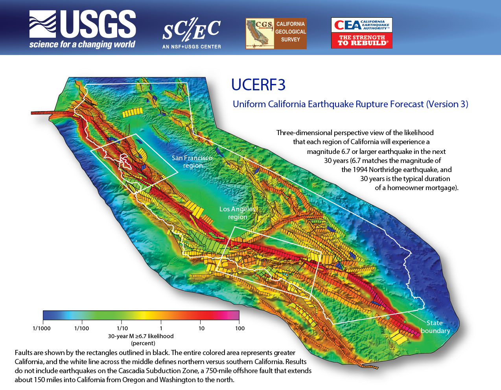

# WGCEP: Working Group on California Earthquake Probabilities

The WGCEP is responsible for developing Uniform California Earthquake Forecasts (UCERFs) using the best available science.

The working group convenes periodically to build statewide, time-dependent earthquake rupture forecasts (ERFs) that are endorsed by the [United States Geological Survey (USGS)](https://www.usgs.gov/), the [Southern California Earthquake Center (SCEC)](https://www.scec.org/), and the [California Geological Survey (CGS)](https://www.conservation.ca.gov/cgs).

The latest available model is UCERF3. Full [UCERF3 model and reports are available here](UCERF3).

